<p align="center">
  
</p>

<h1 align="center">Kubely</h1>

<p align="center">
  <strong>A mobile cockpit for Kubernetes. 100% on-device, no backend.</strong>
</p>

<p align="center">
  <a href="#features">Features</a> &middot;
  <a href="#screenshots">Screenshots</a> &middot;
  <a href="#getting-started">Getting Started</a> &middot;
  <a href="#architecture">Architecture</a> &middot;
  <a href="#contributing">Contributing</a> &middot;
  <a href="#license">License</a>
</p>

---

Kubely is a **cross-platform mobile app** (iOS & Android) that lets you manage Kubernetes clusters from your phone. Connect to EKS, GKE, or self-hosted clusters using your kubeconfig. Browse workloads, inspect pods, tail logs, exec into containers, manage Helm releases, and monitor cluster health &mdash; all from a single dark, data-dense interface built for operators on the go.

**No account. No backend. No telemetry.** Your kubeconfig stays on your device, encrypted at rest, and talks directly to your cluster API.

## Features

**Cluster Management**
- Import clusters via paste, file picker, or QR code
- Auto-detects EKS, GKE, and self-hosted providers
- Switch between multiple clusters with one tap
- Secure on-device storage (Keychain / EncryptedSharedPreferences)

**Dashboard & Monitoring**
- At-a-glance health dashboard with cluster health %, CPU/memory usage
- Real-time pod, deployment, and node counts
- Alerts for CrashLoopBackOff, Pending, and Failed pods
- Three home screen variants (Vitals, Command, Pulse)

**Workload Management**
- Browse Pods, Deployments, and Services with namespace filtering
- Pod detail: containers, resource requests/limits, events, node placement
- Deployment detail: real pod list from label selectors, scaling, restarts
- Swipe-to-reveal actions (Restart, Delete) on list rows

**Live Shell & Logs**
- kubectl-style command proxy (`get`, `describe`, `delete`, `version`)
- WebSocket exec into pod containers with interactive terminal
- Mobile key accessory bar (esc, tab, ctrl, pipe, tilde)
- Real-time log streaming with follow mode and timestamps toggle

**Network, Storage & Config**
- Services & Ingresses with detail views
- PersistentVolumeClaims with capacity and storage class
- ConfigMap viewer/editor with live PATCH support
- Secrets list (read-only, masked values)

**Helm Releases**
- Deduplicated release list across namespaces
- Revision history with status badges
- Rollback and uninstall guidance via CLI hints

**Nodes**
- Node list with instance type, cordon status
- Real CPU/memory metrics from metrics-server
- Pod count per node
- Cordon/uncordon actions

**Events**
- Live event feed with severity filtering (Warning/Normal)
- Namespace-scoped with real-time updates

**Authentication**
- Bearer token auth
- Client certificate (mTLS)
- AWS EKS: SigV4 STS token generation with auto-refresh
- Google GKE: OAuth2 device authorization flow

**Polish**
- Dark, neon-on-near-black design language
- Space Grotesk (UI) + JetBrains Mono (data) typography
- Reduced motion support (respects system accessibility settings)
- Semantic labels for screen readers
- Text overflow protection on all resource name displays

## Screenshots

<p align="center">
  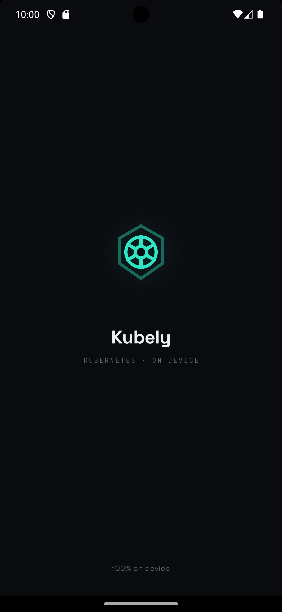
  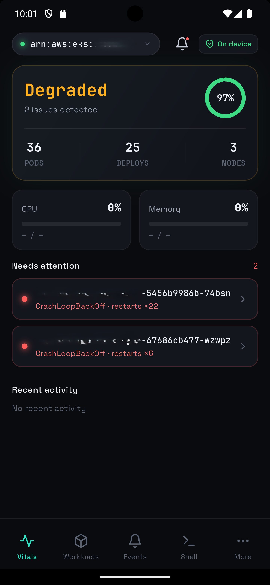
  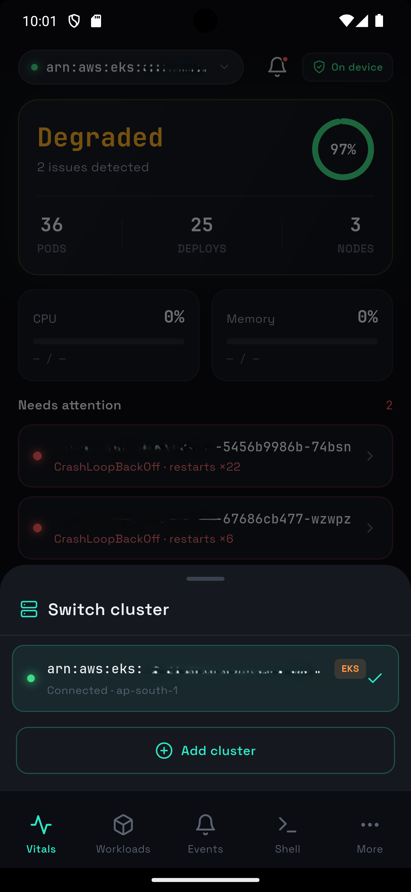
  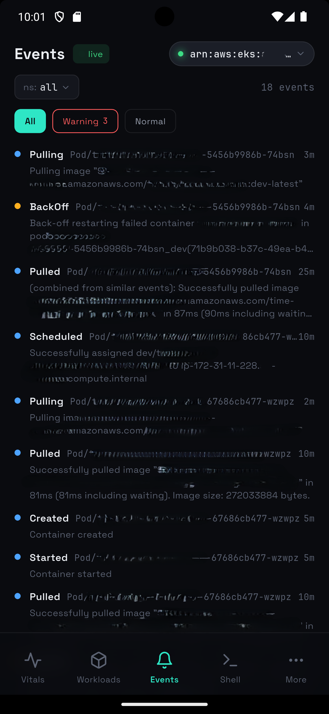
</p>

<p align="center">
  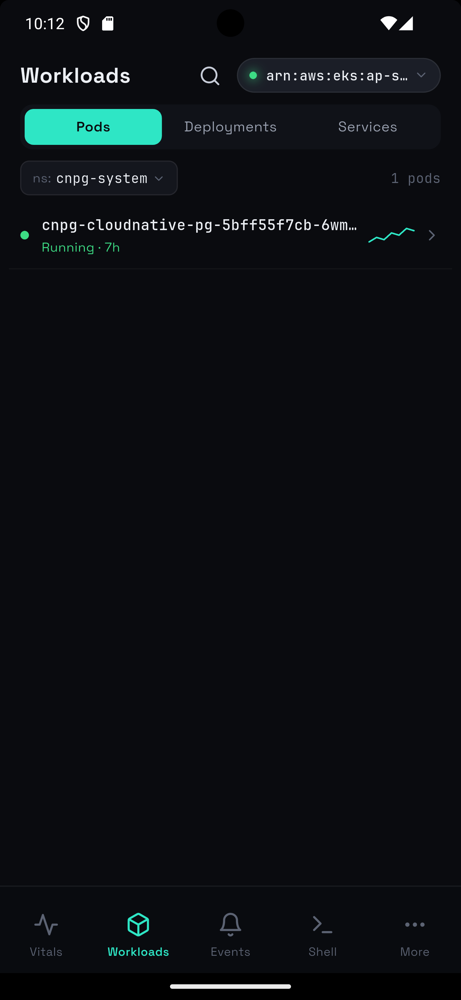
  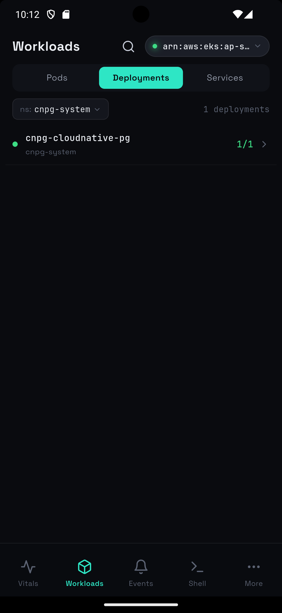
  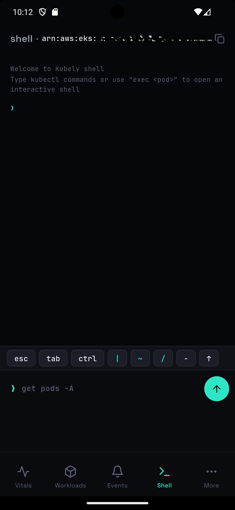
  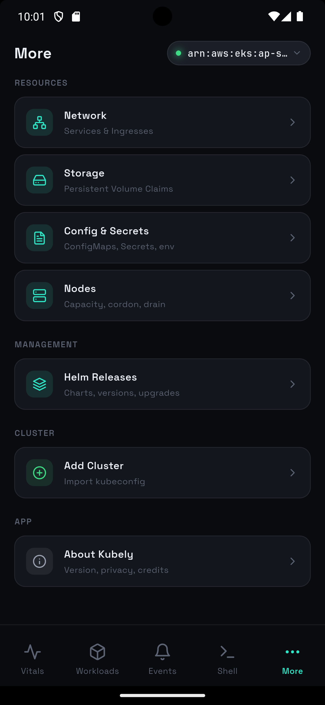
</p>

<p align="center">
  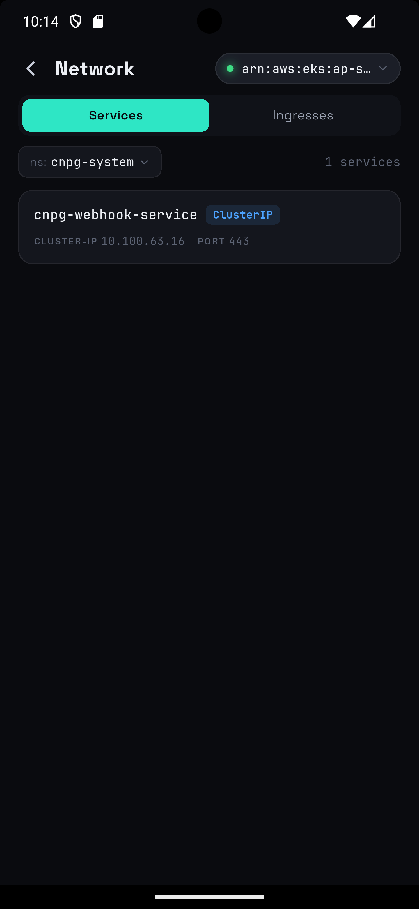
  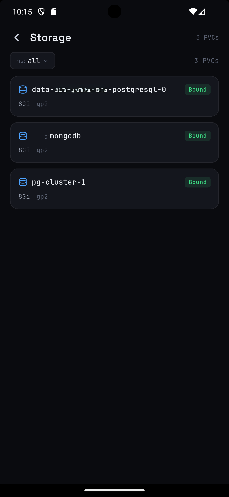
  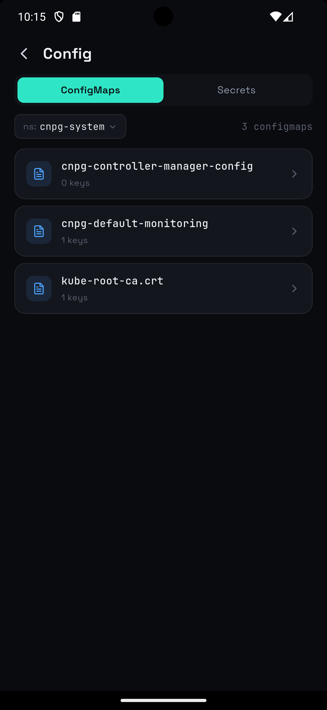
  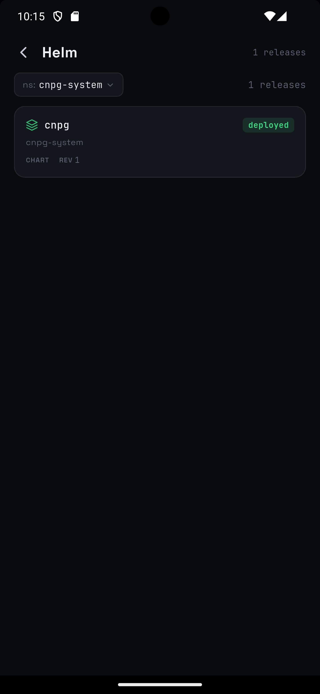
</p>

<p align="center">
  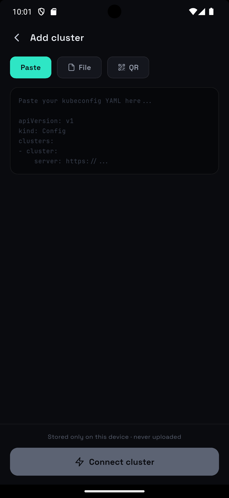
  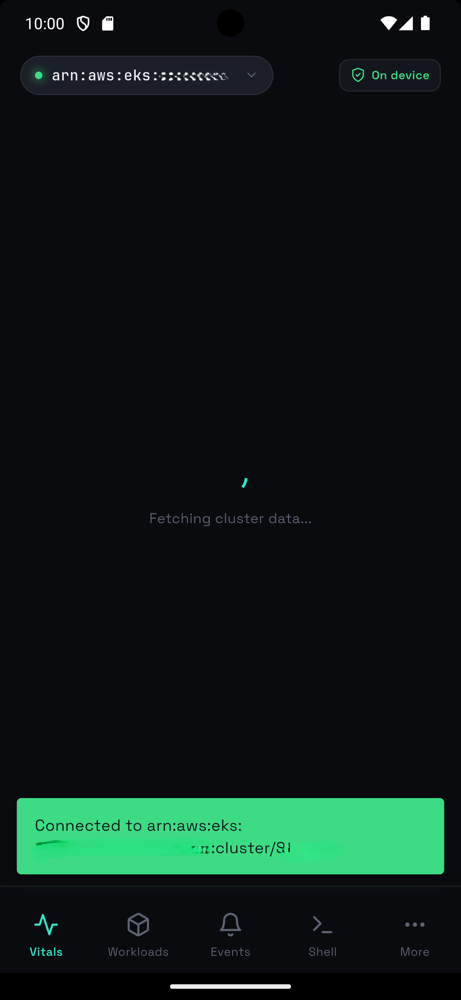
</p>

## Getting Started

### Prerequisites

- [Flutter SDK](https://docs.flutter.dev/get-started/install) 3.11+
- iOS: Xcode 15+ (for iOS builds)
- Android: Android Studio with SDK 34+

### Clone & Run

```bash
git clone https://github.com/your-org/kubely.git
cd kubely
flutter pub get
flutter run
```

### Add a Cluster

1. Open the app &mdash; you'll land on the **Add Cluster** screen
2. Paste your kubeconfig YAML, pick a file, or scan a QR code
3. Select a context from the detected list
4. Tap **Connect cluster**

Your kubeconfig is stored in the device's secure enclave and never leaves the device.

### Demo Mode

The app ships with three built-in demo clusters (`prod-eks-use1`, `staging-gke`, `minikube-local`) that show mock data so you can explore the UI without connecting a real cluster.

## Architecture

```
lib/
  core/            Design tokens, theme, constants, utils
  data/
    models/        Dart data classes (Cluster, Pod, Deployment, etc.)
    services/      API client, auth (EKS/GKE), WebSocket, log streaming
    repositories/  Kubeconfig parser
  state/
    providers/     Riverpod providers (cluster, namespace, K8s data, mock data)
  ui/
    shell/         App shell, bottom tab bar
    shared/        Reusable widgets (17 components)
    screens/       Screen implementations (12 screen groups)
```

### Key Decisions

| Area | Choice | Why |
|---|---|---|
| Framework | Flutter | Single codebase for iOS + Android |
| State | Riverpod | Type-safe, testable, supports async providers |
| Routing | GoRouter | Declarative, supports shell routes for tab navigation |
| HTTP | Dio | Interceptors for auth refresh, streaming response support |
| WebSocket | web_socket_channel | K8s exec uses `v4.channel.k8s.io` subprotocol |
| Storage | flutter_secure_storage | Keychain (iOS) / EncryptedSharedPreferences (Android) |
| Icons | Lucide | Feather-style stroke icons matching the design language |

### Data Flow

```
Screen
  -> ref.watch(provider)
    -> Mock data (demo clusters) OR real K8s API
      -> KubernetesApiClient (Dio + auth interceptors)
        -> Cluster API server (direct, no proxy)
```

All data flows directly between the device and the Kubernetes API server. There is no intermediary backend.

## Tech Stack

- **Flutter** 3.11+ / Dart 3.11+
- **Riverpod** for state management
- **GoRouter** for navigation
- **Dio** for HTTP + streaming
- **web_socket_channel** for pod exec
- **flutter_secure_storage** for credential storage
- **mobile_scanner** for QR code import
- **flutter_animate** for UI animations
- **Space Grotesk** + **JetBrains Mono** bundled fonts

## Contributing

Contributions are welcome! Please:

1. Fork the repository
2. Create a feature branch (`git checkout -b feature/my-feature`)
3. Make your changes
4. Run `flutter analyze` and `flutter test` to verify
5. Submit a pull request

Please keep the existing code style: no comments unless the *why* is non-obvious, use the design token system for all colors/typography, and test on both iOS and Android when possible.

## Security

Kubely is designed with a security-first approach:

- **Zero network egress** beyond your cluster API &mdash; no analytics, no crash reporting, no phone-home
- **Kubeconfigs stored encrypted** via platform secure storage (Keychain / EncryptedSharedPreferences)
- **TLS verified** against the CA in your kubeconfig (with opt-out for `insecure-skip-tls-verify`)
- **Tokens auto-refresh** &mdash; EKS STS tokens regenerate before expiry; GKE OAuth tokens refresh via stored refresh tokens

If you discover a security vulnerability, please report it privately via GitHub Security Advisories rather than opening a public issue.

## License

Kubely is released under the [Apache License 2.0](LICENSE). See the [LICENSE](LICENSE) file for details.

---

<p align="center">
  <sub>Built with Flutter. Designed for operators who need their cluster in their pocket.</sub>
</p>
